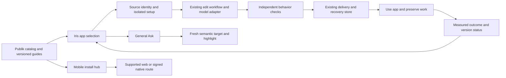

# Iris: a lightweight product that completes the user's task

Status: implementation is underway on `codex/iris-lightweight-20260912`, based on `080ba93`. Mann's draft PR #1 stays frozen while he integrates it. This document supersedes older model defaults and feature-only stopping criteria for this phase. Current implementation and remaining acceptance work are in [CONTINUATION.md](CONTINUATION.md).

The goal is that a nontechnical person can find an app, install or open it, ask for help, request a useful change, use the result, and recover from a bad update. Each journey must preserve their work, explain unavoidable actions, and consume bounded storage and model work. A passing component test or a generated feature is progress, not the finish line.

## The product contract

| Area | What the user should experience | What currently prevents it |
| --- | --- | --- |
| Install | Pick Kneecap, choose the device, continue from the actual source location, and get an actionable next step. Existing projects are preserved. | Local isolated staging and strict workspace metadata are implemented and tested. They are not yet connected to the published guide or the real setup UI. |
| Spatial help | Iris outlines the exact visible control to use. Moving to another tab or window clears outdated guidance. | Semantic identity and freshness checks are implemented and tested. Live outline rendering and reacquisition still need wiring and actual UI evidence. |
| Versions | One installed app, preserved data, safe Undo, and a small understandable backup allowance. | Successful update backups accumulate. Admission stops growth but does not reclaim it. Full lifecycle continuity is not yet proven. |
| Smart routing and complex changes | Plain-language requests produce correct behavior at a measured cost, with a short escalation when necessary. | Complex candidates have failed; route, context quality, retries and accepted outcome are not yet compared together. |
| Mobile | A phone-friendly entry point says Open, Install, or Setup needed using the app's actual supported delivery path. | The lightweight hub prototype passed real phone-sized browser interaction. Verified native distribution destinations and a physical phone run remain absent. |

Ask remains general help with optional context. Edit explicitly names the app to change. Platform catalog identity and guide revision follow the whole journey; they do not become hard-coded local folder guesses.

## Architecture

No new agent framework, general package manager, database, background screenshot recorder, or universal native mobile runtime is required. Extend the existing seams. Headless testing can run in parallel; only one agent controls the shared macOS desktop at a time.

## Execution

1. Read the whole-system design in [DESIGN.md](DESIGN.md) and the frozen counterexamples in [ACCEPTANCE.md](ACCEPTANCE.md).
2. Implement the bounded assignments in [WORK_ORDERS.md](WORK_ORDERS.md) in separate worktrees. Luna Medium/High implements; Terra reviews and takes over only a demonstrated difficult design or correctness problem.
3. Integrate source and targeted checks, then test the actual Iris Test UI. Reuse an accepted candidate to test update and Undo without paying to generate another feature.
4. Report source, automated tests, installed build, actual UI outcome, and physical phone acceptance separately. Stop a completed test family; repeat only after a relevant change or newly identified failure.

Research is recorded under [research/](research/). Those reports are proposals and observations, not proof of shipped behavior. DESIGN.md resolves the mobile recommendation and avoids treating the research agent's one-entry Capacitor wrapper as an approved new runtime. Historical source links in the storage report used a different GitHub owner; local file paths at `080ba93` are the source evidence.

## Delivery boundaries

Normal Iris, all user Kneecap copies, normal profiles, and Mann's PR remain unchanged. Use existing Test isolation, source provenance, signing, secure-input, cancellation, dependency consent, and recovery protections. Fix the next action when a guard blocks a legitimate task. Do not remove a guard to make the test green.

The first implementation wave is instruction compaction, source staging and spatial identity. Mobile starts with a minimal install hub and capability/route contract. Storage and routing/harness then integrate behind the same review and evidence rules. These are work lanes within one product goal, not separate feature definitions of success.
